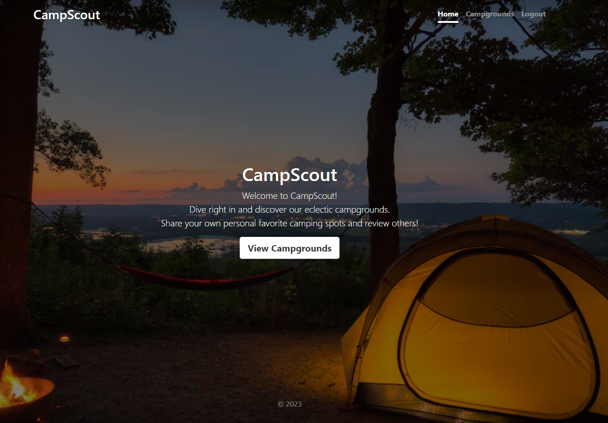
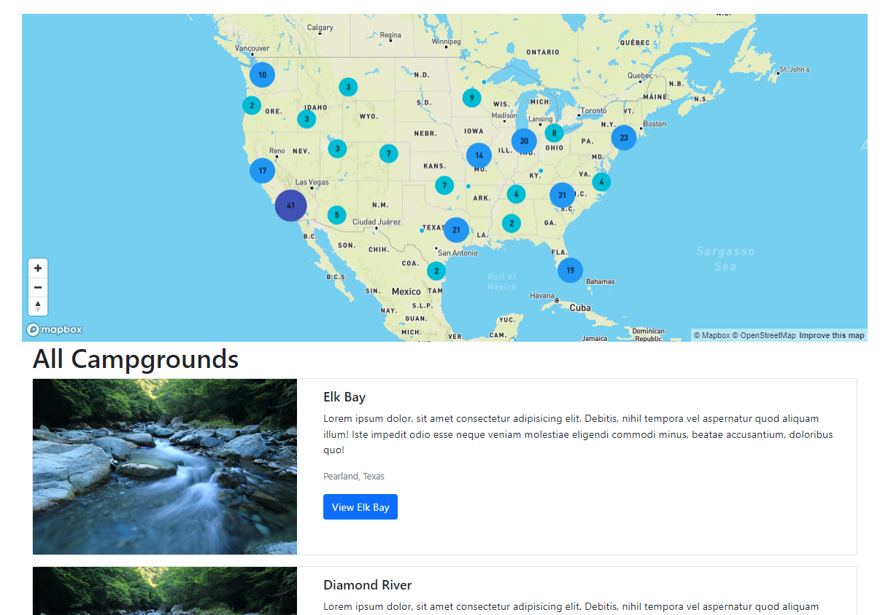
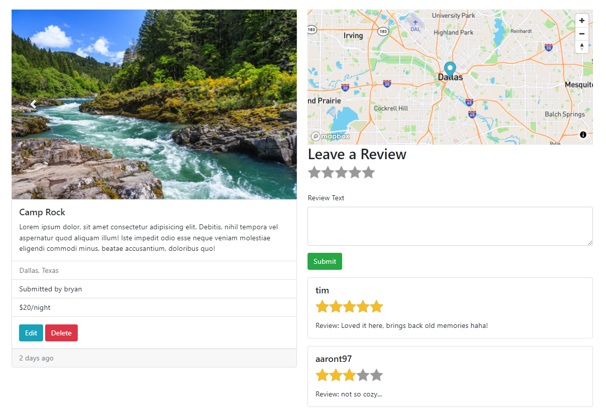
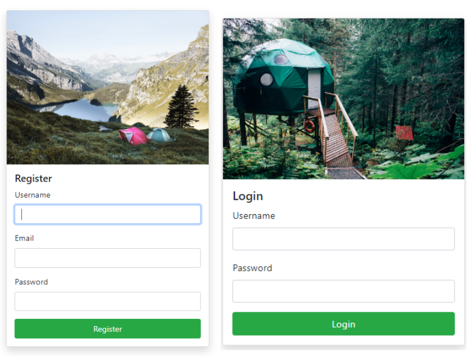

# CampScout :tent:

A full-stack website application where users can create and review eclectic campgrounds. This camp review application is built with Node.js, Express, MongoDB, REST Programming, Bootstrap, HTML, CSS and JavaScript.

## Functionalities

> Users can register and log into their account.
>
> Users can view all campgrounds and their respective reviews without creating an account.
>
> Users can create a campground by adding a title, location, description, price and image.
>
> An interactive cluster map pinpoints the exact longitude and latitude of a particular campground.
>
> Users can leave ratings, and review other people's campgrounds by leaving comments.
>
> Users can edit or delete campgrounds or comments they create.

## Technologies and Tools Used

- **HTML5**
- **CSS3 (Bootstrap)**
- **JavaScript (NodeJS, EJS, Express)**
- **jQuery**
- **REST**
- **MongoDB**
- **Heroku**
- **PassportJS** - (node.js authentication and authorization middleware)
- **JOI** - (data validation)

## Design

> HomePage
> 

> All Campgrounds
> 

> Single Campground ShowPage
> 

> Login & Register Page
> 
> 
